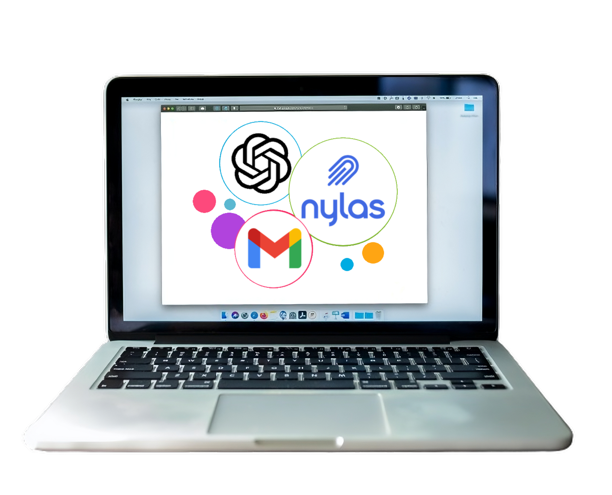

= Code Inbox: Revolutionizing Email Management

== 📜 About Us

Code Inbox is a cutting-edge email client designed to revolutionize email management and algorithmic learning. We are committed to simplifying your email experience and enhancing your algorithmic journey.

== 🌟 Our Vision

Our vision is to empower individuals with a powerful email client that not only streamlines communication but also delivers AI-generated algorithmic posts directly to your inbox. We aim to make learning algorithms effortless and efficient for everyone.

== 🤝 Trusted by Developers Worldwide

Join the growing community of developers who trust Code Inbox for their email management and algorithmic learning needs.

== 🌐 Sponsors

We are looking for awesome sponsors like you to support our mission. Your sponsorship helps us continue to develop and improve Code Inbox, ensuring that it remains a top-notch email client for users around the world. If you're interested in becoming a sponsor, please reach out to us at sponsorship@code-inbox.com.

== ✨ Key Features

Code Inbox comes packed with essential features:

- 🖥️ Intuitive User Interface: Enjoy a user-friendly interface for seamless email management.
- 🧠 Algorithmic Recommendations: Receive AI-generated algorithmic learning posts in your inbox.

== 🚀 What's Coming in 2023

We have an exciting roadmap for 2023:

- 📚 Unified Email Threads: Easily follow entire email threads on a single page.
- 📎 Attachment Support: Share documents, files, and resources with attachments.
- 🌈 Label Coloring: Customize email labels with color coding.
- 👥 Contact Management: Manage your email contacts effortlessly.

== 👥 Join the Code Inbox Community

We welcome developers, designers, and enthusiasts to join our community:

- 📌 GitHub: Contribute to Code Inbox on link:https://github.com/wiseaidev/code-inbox[GitHub].
- 🤝 Contribute: Explore our contribution guidelines and help us improve.
- 📧 Contact Us: Have questions or suggestions? Reach out to us at support@code-inbox.com.
- 🌐 Spread the Word: Share Code Inbox with your network and help us grow.

== 📄 License

Code Inbox is released under the MIT License.
